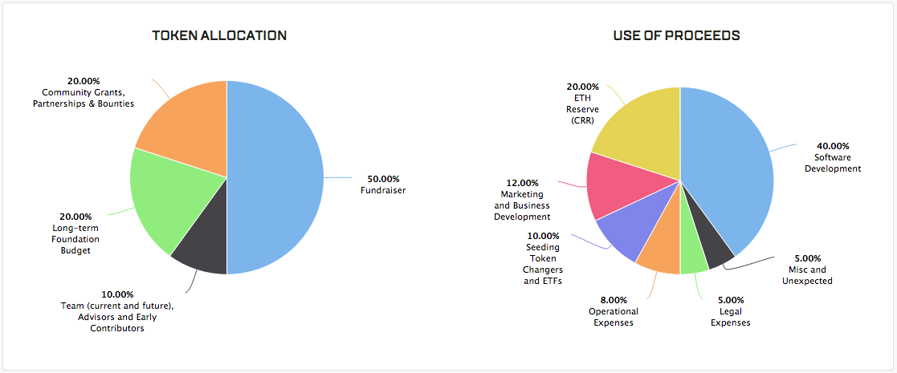

# Bancor Crowdsale Analysis

[Bancor](https://bancor.network) had a [crowdsale](https://bancor.network/fundraiser) where the public contributions started at Jun-12-2017 02:00:17 PM +UTC and ended at Jun-12-2017 04:25:20 PM +UTC. The amount raised was 396,619.8918 ETH (USD 157,176,893 at the current ETH/USD price of 396.2910).

Statistics from their crowdsale page - 39.6M BNT Fundraiser token allocation; 79.3M Total BNT Supply; and 396,720M ETH Raised.



The crowdsale contract had a hardcoded cap of 1,000,000 ETH, and Bancor announced before the crowdsale that they was a hidden cap that would be revealed one hour into the crowdsale.

Bancor made the following announcements on Twitter:

* 7:42 AM - 12 Jun 2017 [BNT fundraiser live, massive attacks on network. Reports of #ethereum transactions pending. All who try 2 get in will be accepted. Stay calm](https://twitter.com/BancorNetwork/status/874275828653314048)
* 8:11 AM - 12 Jun 2017 [BNT allocation event MINIMUM TIME EXTENDED TO 3 HOURS due to massive malicious attacks on network & resulting pending transaction bottleneck](https://twitter.com/BancorNetwork/status/874283097143037954)
* 9:15 AM - 12 Jun 2017 [Massive attacks are on our network, website and application. Not on Ethereum](https://twitter.com/BancorNetwork/status/874299034667814912)
* 9:26 AM - 12 Jun 2017 [Clarification: The transaction triggering hidden cap is currently stuck together w/ other transaction due to massive attacks on our network](https://twitter.com/BancorNetwork/status/874301834109833217)

The hidden cap was only revealed (and set, halting further contributions) 2 hours and 25 minutes into the crowdsale, after the amount raised of 396 KETH exceeded the then un-revealed cap of 250 KETH.

Regarding the "massive attacks on our network", inspection of some randomly chosen blocks at the start [3861206](https://etherscan.io/txs?block=3861206), middle [3861509](https://etherscan.io/txs?block=3861509) and end [3861761](https://etherscan.io/txs?block=3861761) of the crowdsale shows that the transactions are mostly BancorCrowdsale's transactions with other regular transactions in between.

Bancor used a multisig wallet to execute the `enableRealCap(...)` transaction, requiring 2 separate transactions [0x52dffab9](https://etherscan.io/tx/0x52dffab952f9b69a2c7fdab6b9e52ace98ec44559d8239688a5e88578b5c5e15) and [0x40d2abb4](https://etherscan.io/tx/0x40d2abb4e411ffd8e0ccb422f4fcacae3dc0967125fe5f6e6a45d48cc87e44e6) to set the 250 KETH cap. The first part was mined 2 hours and 17 minutes into the crowdsale, and the second part was mined 2 hours and 25 minutes into the crowdsale.

Bancor had set a maximum gas price of 50 gwei (50000000000 wei) that crowdsale contributors could send their transaction with. Bancor executed both multisig transactions with a 100 gwei gas price, and these should have been executed in priority to the valid crowdsale contribution transactions.

<br />

Some other news/information on the Bancor crowdsale:

* [Bancor Sets New Record with $153 Million ‘ICO’](https://www.cryptocoinsnews.com/bancor-sets-new-ico-record/)
* [$150 Million: Tim Draper-Backed Bancor Completes Largest-Ever ICO](http://www.coindesk.com/150-million-tim-draper-backed-bancor-completes-largest-ever-ico/)
* [Bancor Crowdsale Raises Over $140 Million in Less Than Three Hours](https://www.financemagnates.com/cryptocurrency/news/bancor-crowdsale-raises-140-million-less-three-hours/)

<br />

## What Could Have Been Done Better

* Allow the setting of the cap using a single transaction instead of a 2 part multisig transaction. This transaction could be enabled to execute from another (few) permissioned account if necessary
* Work out how to prioritise the hidden cap transaction over the high traffic crowdsale contributions
* Expect a lot of traffic on your website

<br />

<hr />

# Details

## The Hardcoded Cap

From their source:

    uint256 public totalEtherCap = 1000000 ether;   // current ether contribution cap, initialized with a temp value as a safety mechanism until the real cap is revealed

(USD 396,291,000 at the current ETH/USD price of 396.2910)

<br />

## Wallet Transactions

Wallet at [0x5894110995b8c8401bd38262ba0c8ee41d4e4658](https://etherscan.io/address/0x5894110995b8c8401bd38262ba0c8ee41d4e4658).

First 3 transactions not related to the public crowdsale:

* #[3851003](https://etherscan.io/block/3851003) [0x9ac3301f](https://etherscan.io/tx/0x9ac3301f6171358bb90791798b9623fdf7f8a3437c5557f2fbd0261bbd59e4d3) 0.01
* #[3851355](https://etherscan.io/block/3851355) Jun-10-2017 04:58:43 PM +UTC `contributeBTCs()` to the crowdsale contract [0xf125676c](https://etherscan.io/tx/0xf125676c8aa70d8b15fe2011415286f91a89afdcc4c0956c012b81b5b16f4f1e) 0.01

Next transaction seems to be a `contributeBTCs()` contribution:

* #[3860991](https://etherscan.io/block/3860991) Jun-10-2017 04:58:43 PM +UTC [0x5a9c1306](https://etherscan.io/tx/0x5a9c1306ce7346e7540dae4dbf98a74ad5f7e1a65913112e4a35bc68a277a8f0) 19,999.99

First block with public crowdsale contributions #[3861203](https://etherscan.io/block/3861203).

Last block with public crowdsale contribution #[3861767](https://etherscan.io/block/3861767).

<br />

## Crowdsale Transactions

* #[3851207](https://etherscan.io/block/3851207) Jun-10-2017 04:20:11 PM +UTC Contract creation [0xfdb8f191](https://etherscan.io/tx/0xfdb8f1915348a3fed791431c4e91d22932166cb1a973b4507eb458c0081bcbbb)
* #[3851291](https://etherscan.io/block/3851291) Jun-10-2017 04:42:52 PM +UTC `acceptTokenOwnership()` [0x11f905a9](https://etherscan.io/tx/0x11f905a9fbb049d91d8b4f6990633867a1f80b03eaee74c7613397453e91dba4)
* #[3851355](https://etherscan.io/block/3851355) Jun-10-2017 04:58:43 PM +UTC `contributeBTCs()` [0xf125676c](https://etherscan.io/tx/0xf125676c8aa70d8b15fe2011415286f91a89afdcc4c0956c012b81b5b16f4f1e)
* #[3851433](https://etherscan.io/block/3851433) Jun-10-2017 05:24:08 PM +UTC `issueTokens(...)` [0xf68e53d4](https://etherscan.io/tx/0xf68e53d4940740eacc8428670d1477295ffb4a02137d4b4a12d89850fe20c012)
* #[3851463](https://etherscan.io/block/3851463) Jun-10-2017 05:32:18 PM +UTC `transferOwnership(...)` [0x62b034af](https://etherscan.io/tx/0x62b034afafab596bf4331a0a6c4eaea2dbf02313bfb35e3edb4051049254f66b)
* #[3860991](https://etherscan.io/block/3860991) Jun-12-2017 12:59:04 PM +UTC `contributeBTCs()` [0x5a9c1306](https://etherscan.io/tx/0x5a9c1306ce7346e7540dae4dbf98a74ad5f7e1a65913112e4a35bc68a277a8f0)
* #[3861203](https://etherscan.io/block/3861203) Jun-12-2017 02:00:17 PM +UTC First transaction
* #[3861740](https://etherscan.io/block/3861740) TxIndx 1 Jun-12-2017 04:17:50 PM +UTC Multisig `submitTransaction(enableRealCap(...))` [0x52dffab9](https://etherscan.io/tx/0x52dffab952f9b69a2c7fdab6b9e52ace98ec44559d8239688a5e88578b5c5e15) Preparing to set *totalEtherCap* to 250,000.000000000000000000 ETH - [source](https://www.reddit.com/r/ethereum/comments/6gyu6w/transaction_triggering_cap_of_bancor_sale_had_a/)
* #[3861767](https://etherscan.io/block/3861767) Jun-12-2017 04:25:20 PM +UTC Last transaction
* #[3861768](https://etherscan.io/block/3861768) TxIndx 1 Jun-12-2017 04:25:42 PM +UTC Multisig Confirmation of `submitTransaction(enableRealCap(...))` [0x40d2abb4](https://etherscan.io/tx/0x40d2abb4e411ffd8e0ccb422f4fcacae3dc0967125fe5f6e6a45d48cc87e44e6) Executing set *totalEtherCap* to 250,000.000000000000000000 ETH - [source](https://www.reddit.com/r/ethereum/comments/6gyu6w/transaction_triggering_cap_of_bancor_sale_had_a/)

There is also a BTCS ether cap of 50,000.000000000000000000 ETH, making the total cap 300,000 ETH.

## Transaction Data
The raw data from running [script/getBancorCrowdsaleData.sh](script/getBancorCrowdsaleData.sh) can be found in [data/data.tsv](data/data.tsv) and the Excel form in [data/data.xls](data/data.xls). Note that this data has slight inconsistencies and does not include the `contributeBtcs()` generated tokens.

Also note that tokens of the same amount as returned to the contributing account were also generated for the "beneficiary" account [0x5894110995b8c8401bd38262ba0c8ee41d4e4658](https://etherscan.io/token/Bancor?a=0x5894110995b8c8401bd38262ba0c8ee41d4e4658) and total 39,661,989.1803711283883108 Bancor - [50.0000%].

## Contribution Event Data

The raw data from running [script/getBancorCrowdsaleEventData.sh](script/getBancorCrowdsaleEventData.sh) can be found in [data/events.tsv](data/events.tsv) and the Excel form in [data/events.xls](data/events.xls). Note that this data does not tally with the reported totals from Bancor's website.

## Contribution Event Data v2 Including Contract Internal Data

The raw data from running [script/getBancorCrowdsaleEventDataV2.sh](script/getBancorCrowdsaleEventDataV2.sh) can be found in [data/eventsV2.tsv](data/eventsV2.tsv) and the Excel form in [data/eventsV2.xls](data/eventsV2.xls). Note that this data still does not tally with the reported totals from Bancor's website.

<br />

<hr />

# Crowdsale Contract

* 100 tokens to 1 ETH

From [0xbbc79794599b19274850492394004087cbf89710](https://etherscan.io/address/0xbbc79794599b19274850492394004087cbf89710#code):

```javascript
pragma solidity ^0.4.11;

/*
    Overflow protected math functions
*/
contract SafeMath {
    /**
        constructor
    */
    function SafeMath() {
    }

    /**
        @dev returns the sum of _x and _y, asserts if the calculation overflows

        @param _x   value 1
        @param _y   value 2

        @return sum
    */
    function safeAdd(uint256 _x, uint256 _y) internal returns (uint256) {
        uint256 z = _x + _y;
        assert(z >= _x);
        return z;
    }

    /**
        @dev returns the difference of _x minus _y, asserts if the subtraction results in a negative number

        @param _x   minuend
        @param _y   subtrahend

        @return difference
    */
    function safeSub(uint256 _x, uint256 _y) internal returns (uint256) {
        assert(_x >= _y);
        return _x - _y;
    }

    /**
        @dev returns the product of multiplying _x by _y, asserts if the calculation overflows

        @param _x   factor 1
        @param _y   factor 2

        @return product
    */
    function safeMul(uint256 _x, uint256 _y) internal returns (uint256) {
        uint256 z = _x * _y;
        assert(_x == 0 || z / _x == _y);
        return z;
    }
}

/*
    Owned contract interface
*/
contract IOwned {
    // this function isn't abstract since the compiler emits automatically generated getter functions as external
    function owner() public constant returns (address owner) { owner; }

    function transferOwnership(address _newOwner) public;
    function acceptOwnership() public;
}

/*
    Provides support and utilities for contract ownership
*/
contract Owned is IOwned {
    address public owner;
    address public newOwner;

    event OwnerUpdate(address _prevOwner, address _newOwner);

    /**
        @dev constructor
    */
    function Owned() {
        owner = msg.sender;
    }

    // allows execution by the owner only
    modifier ownerOnly {
        assert(msg.sender == owner);
        _;
    }

    /**
        @dev allows transferring the contract ownership
        the new owner still need to accept the transfer
        can only be called by the contract owner

        @param _newOwner    new contract owner
    */
    function transferOwnership(address _newOwner) public ownerOnly {
        require(_newOwner != owner);
        newOwner = _newOwner;
    }

    /**
        @dev used by a new owner to accept an ownership transfer
    */
    function acceptOwnership() public {
        require(msg.sender == newOwner);
        OwnerUpdate(owner, newOwner);
        owner = newOwner;
        newOwner = 0x0;
    }
}

/*
    ERC20 Standard Token interface
*/
contract IERC20Token {
    // these functions aren't abstract since the compiler emits automatically generated getter functions as external
    function name() public constant returns (string name) { name; }
    function symbol() public constant returns (string symbol) { symbol; }
    function decimals() public constant returns (uint8 decimals) { decimals; }
    function totalSupply() public constant returns (uint256 totalSupply) { totalSupply; }
    function balanceOf(address _owner) public constant returns (uint256 balance) { _owner; balance; }
    function allowance(address _owner, address _spender) public constant returns (uint256 remaining) { _owner; _spender; remaining; }

    function transfer(address _to, uint256 _value) public returns (bool success);
    function transferFrom(address _from, address _to, uint256 _value) public returns (bool success);
    function approve(address _spender, uint256 _value) public returns (bool success);
}

/*
    Token Holder interface
*/
contract ITokenHolder is IOwned {
    function withdrawTokens(IERC20Token _token, address _to, uint256 _amount) public;
}

/*
    We consider every contract to be a 'token holder' since it's currently not possible
    for a contract to deny receiving tokens.

    The TokenHolder's contract sole purpose is to provide a safety mechanism that allows
    the owner to send tokens that were sent to the contract by mistake back to their sender.
*/
contract TokenHolder is ITokenHolder, Owned {
    /**
        @dev constructor
    */
    function TokenHolder() {
    }

    // validates an address - currently only checks that it isn't null
    modifier validAddress(address _address) {
        require(_address != 0x0);
        _;
    }

    // verifies that the address is different than this contract address
    modifier notThis(address _address) {
        require(_address != address(this));
        _;
    }

    /**
        @dev withdraws tokens held by the contract and sends them to an account
        can only be called by the owner

        @param _token   ERC20 token contract address
        @param _to      account to receive the new amount
        @param _amount  amount to withdraw
    */
    function withdrawTokens(IERC20Token _token, address _to, uint256 _amount)
        public
        ownerOnly
        validAddress(_token)
        validAddress(_to)
        notThis(_to)
    {
        assert(_token.transfer(_to, _amount));
    }
}

/*
    Smart Token interface
*/
contract ISmartToken is ITokenHolder, IERC20Token {
    function disableTransfers(bool _disable) public;
    function issue(address _to, uint256 _amount) public;
    function destroy(address _from, uint256 _amount) public;
}

/*
    The smart token controller is an upgradable part of the smart token that allows
    more functionality as well as fixes for bugs/exploits.
    Once it accepts ownership of the token, it becomes the token's sole controller
    that can execute any of its functions.

    To upgrade the controller, ownership must be transferred to a new controller, along with
    any relevant data.

    The smart token must be set on construction and cannot be changed afterwards.
    Wrappers are provided (as opposed to a single 'execute' function) for each of the token's functions, for easier access.

    Note that the controller can transfer token ownership to a new controller that
    doesn't allow executing any function on the token, for a trustless solution.
    Doing that will also remove the owner's ability to upgrade the controller.
*/
contract SmartTokenController is TokenHolder {
    ISmartToken public token;   // smart token

    /**
        @dev constructor
    */
    function SmartTokenController(ISmartToken _token)
        validAddress(_token)
    {
        token = _token;
    }

    // ensures that the controller is the token's owner
    modifier active() {
        assert(token.owner() == address(this));
        _;
    }

    // ensures that the controller is not the token's owner
    modifier inactive() {
        assert(token.owner() != address(this));
        _;
    }

    /**
        @dev allows transferring the token ownership
        the new owner still need to accept the transfer
        can only be called by the contract owner

        @param _newOwner    new token owner
    */
    function transferTokenOwnership(address _newOwner) public ownerOnly {
        token.transferOwnership(_newOwner);
    }

    /**
        @dev used by a new owner to accept a token ownership transfer
        can only be called by the contract owner
    */
    function acceptTokenOwnership() public ownerOnly {
        token.acceptOwnership();
    }

    /**
        @dev disables/enables token transfers
        can only be called by the contract owner

        @param _disable    true to disable transfers, false to enable them
    */
    function disableTokenTransfers(bool _disable) public ownerOnly {
        token.disableTransfers(_disable);
    }

    /**
        @dev allows the owner to execute the token's issue function

        @param _to         account to receive the new amount
        @param _amount     amount to increase the supply by
    */
    function issueTokens(address _to, uint256 _amount) public ownerOnly {
        token.issue(_to, _amount);
    }

    /**
        @dev allows the owner to execute the token's destroy function

        @param _from       account to remove the amount from
        @param _amount     amount to decrease the supply by
    */
    function destroyTokens(address _from, uint256 _amount) public ownerOnly {
        token.destroy(_from, _amount);
    }

    /**
        @dev withdraws tokens held by the token and sends them to an account
        can only be called by the owner

        @param _token   ERC20 token contract address
        @param _to      account to receive the new amount
        @param _amount  amount to withdraw
    */
    function withdrawFromToken(IERC20Token _token, address _to, uint256 _amount) public ownerOnly {
        token.withdrawTokens(_token, _to, _amount);
    }
}

/*
    Crowdsale v0.1

    The crowdsale version of the smart token controller, allows contributing ether in exchange for Bancor tokens
    The price remains fixed for the entire duration of the crowdsale
    Note that 20% of the contributions are the Bancor token's reserve
*/
contract CrowdsaleController is SmartTokenController, SafeMath {
    uint256 public constant DURATION = 14 days;                 // crowdsale duration
    uint256 public constant TOKEN_PRICE_N = 1;                  // initial price in wei (numerator)
    uint256 public constant TOKEN_PRICE_D = 100;                // initial price in wei (denominator)
    uint256 public constant BTCS_ETHER_CAP = 50000 ether;       // maximum bitcoin suisse ether contribution
    uint256 public constant MAX_GAS_PRICE = 50000000000 wei;    // maximum gas price for contribution transactions

    string public version = '0.1';

    uint256 public startTime = 0;                   // crowdsale start time (in seconds)
    uint256 public endTime = 0;                     // crowdsale end time (in seconds)
    uint256 public totalEtherCap = 1000000 ether;   // current ether contribution cap, initialized with a temp value as a safety mechanism until the real cap is revealed
    uint256 public totalEtherContributed = 0;       // ether contributed so far
    bytes32 public realEtherCapHash;                // ensures that the real cap is predefined on deployment and cannot be changed later
    address public beneficiary = 0x0;               // address to receive all ether contributions
    address public btcs = 0x0;                      // bitcoin suisse address

    // triggered on each contribution
    event Contribution(address indexed _contributor, uint256 _amount, uint256 _return);

    /**
        @dev constructor

        @param _token          smart token the crowdsale is for
        @param _startTime      crowdsale start time
        @param _beneficiary    address to receive all ether contributions
        @param _btcs           bitcoin suisse address
    */
    function CrowdsaleController(ISmartToken _token, uint256 _startTime, address _beneficiary, address _btcs, bytes32 _realEtherCapHash)
        SmartTokenController(_token)
        validAddress(_beneficiary)
        validAddress(_btcs)
        earlierThan(_startTime)
        validAmount(uint256(_realEtherCapHash))
    {
        startTime = _startTime;
        endTime = startTime + DURATION;
        beneficiary = _beneficiary;
        btcs = _btcs;
        realEtherCapHash = _realEtherCapHash;
    }

    // verifies that an amount is greater than zero
    modifier validAmount(uint256 _amount) {
        require(_amount > 0);
        _;
    }

    // verifies that the gas price is lower than 50 gwei
    modifier validGasPrice() {
        assert(tx.gasprice <= MAX_GAS_PRICE);
        _;
    }

    // verifies that the ether cap is valid based on the key provided
    modifier validEtherCap(uint256 _cap, uint256 _key) {
        require(computeRealCap(_cap, _key) == realEtherCapHash);
        _;
    }

    // ensures that it's earlier than the given time
    modifier earlierThan(uint256 _time) {
        assert(now < _time);
        _;
    }

    // ensures that the current time is between _startTime (inclusive) and _endTime (exclusive)
    modifier between(uint256 _startTime, uint256 _endTime) {
        assert(now >= _startTime && now < _endTime);
        _;
    }

    // ensures that the sender is bitcoin suisse
    modifier btcsOnly() {
        assert(msg.sender == btcs);
        _;
    }

    // ensures that we didn't reach the ether cap
    modifier etherCapNotReached(uint256 _contribution) {
        assert(safeAdd(totalEtherContributed, _contribution) <= totalEtherCap);
        _;
    }

    // ensures that we didn't reach the bitcoin suisse ether cap
    modifier btcsEtherCapNotReached(uint256 _ethContribution) {
        assert(safeAdd(totalEtherContributed, _ethContribution) <= BTCS_ETHER_CAP);
        _;
    }

    /**
        @dev computes the real cap based on the given cap & key

        @param _cap    cap
        @param _key    key used to compute the cap hash

        @return computed real cap hash
    */
    function computeRealCap(uint256 _cap, uint256 _key) public constant returns (bytes32) {
        return keccak256(_cap, _key);
    }

    /**
        @dev enables the real cap defined on deployment

        @param _cap    predefined cap
        @param _key    key used to compute the cap hash
    */
    function enableRealCap(uint256 _cap, uint256 _key)
        public
        ownerOnly
        active
        between(startTime, endTime)
        validEtherCap(_cap, _key)
    {
        require(_cap < totalEtherCap); // validate input
        totalEtherCap = _cap;
    }

    /**
        @dev computes the number of tokens that should be issued for a given contribution

        @param _contribution    contribution amount

        @return computed number of tokens
    */
    function computeReturn(uint256 _contribution) public constant returns (uint256) {
        return safeMul(_contribution, TOKEN_PRICE_D) / TOKEN_PRICE_N;
    }

    /**
        @dev ETH contribution
        can only be called during the crowdsale

        @return tokens issued in return
    */
    function contributeETH()
        public
        payable
        between(startTime, endTime)
        returns (uint256 amount)
    {
        return processContribution();
    }

    /**
        @dev Contribution through BTCs (Bitcoin Suisse only)
        can only be called before the crowdsale started

        @return tokens issued in return
    */
    function contributeBTCs()
        public
        payable
        btcsOnly
        btcsEtherCapNotReached(msg.value)
        earlierThan(startTime)
        returns (uint256 amount)
    {
        return processContribution();
    }

    /**
        @dev handles contribution logic
        note that the Contribution event is triggered using the sender as the contributor, regardless of the actual contributor

        @return tokens issued in return
    */
    function processContribution() private
        active
        etherCapNotReached(msg.value)
        validGasPrice
        returns (uint256 amount)
    {
        uint256 tokenAmount = computeReturn(msg.value);
        assert(beneficiary.send(msg.value)); // transfer the ether to the beneficiary account
        totalEtherContributed = safeAdd(totalEtherContributed, msg.value); // update the total contribution amount
        token.issue(msg.sender, tokenAmount); // issue new funds to the contributor in the smart token
        token.issue(beneficiary, tokenAmount); // issue tokens to the beneficiary

        Contribution(msg.sender, msg.value, tokenAmount);
        return tokenAmount;
    }

    // fallback
    function() payable {
        contributeETH();
    }
}
```

<br />

<hr />

# Token Contract

From [0x1f573d6fb3f13d689ff844b4ce37794d79a7ff1c](https://etherscan.io/address/0x1f573d6fb3f13d689ff844b4ce37794d79a7ff1c):

```javascript
pragma solidity ^0.4.11;

/*
    Overflow protected math functions
*/
contract SafeMath {
    /**
        constructor
    */
    function SafeMath() {
    }

    /**
        @dev returns the sum of _x and _y, asserts if the calculation overflows

        @param _x   value 1
        @param _y   value 2

        @return sum
    */
    function safeAdd(uint256 _x, uint256 _y) internal returns (uint256) {
        uint256 z = _x + _y;
        assert(z >= _x);
        return z;
    }

    /**
        @dev returns the difference of _x minus _y, asserts if the subtraction results in a negative number

        @param _x   minuend
        @param _y   subtrahend

        @return difference
    */
    function safeSub(uint256 _x, uint256 _y) internal returns (uint256) {
        assert(_x >= _y);
        return _x - _y;
    }

    /**
        @dev returns the product of multiplying _x by _y, asserts if the calculation overflows

        @param _x   factor 1
        @param _y   factor 2

        @return product
    */
    function safeMul(uint256 _x, uint256 _y) internal returns (uint256) {
        uint256 z = _x * _y;
        assert(_x == 0 || z / _x == _y);
        return z;
    }
} 

/*
    Owned contract interface
*/
contract IOwned {
    // this function isn't abstract since the compiler emits automatically generated getter functions as external
    function owner() public constant returns (address owner) { owner; }

    function transferOwnership(address _newOwner) public;
    function acceptOwnership() public;
}

/*
    Provides support and utilities for contract ownership
*/
contract Owned is IOwned {
    address public owner;
    address public newOwner;

    event OwnerUpdate(address _prevOwner, address _newOwner);

    /**
        @dev constructor
    */
    function Owned() {
        owner = msg.sender;
    }

    // allows execution by the owner only
    modifier ownerOnly {
        assert(msg.sender == owner);
        _;
    }

    /**
        @dev allows transferring the contract ownership
        the new owner still need to accept the transfer
        can only be called by the contract owner

        @param _newOwner    new contract owner
    */
    function transferOwnership(address _newOwner) public ownerOnly {
        require(_newOwner != owner);
        newOwner = _newOwner;
    }

    /**
        @dev used by a new owner to accept an ownership transfer
    */
    function acceptOwnership() public {
        require(msg.sender == newOwner);
        OwnerUpdate(owner, newOwner);
        owner = newOwner;
        newOwner = 0x0;
    }
}

/*
    Token Holder interface
*/
contract ITokenHolder is IOwned {
    function withdrawTokens(IERC20Token _token, address _to, uint256 _amount) public;
}

/*
    We consider every contract to be a 'token holder' since it's currently not possible
    for a contract to deny receiving tokens.

    The TokenHolder's contract sole purpose is to provide a safety mechanism that allows
    the owner to send tokens that were sent to the contract by mistake back to their sender.
*/
contract TokenHolder is ITokenHolder, Owned {
    /**
        @dev constructor
    */
    function TokenHolder() {
    }

    // validates an address - currently only checks that it isn't null
    modifier validAddress(address _address) {
        require(_address != 0x0);
        _;
    }

    // verifies that the address is different than this contract address
    modifier notThis(address _address) {
        require(_address != address(this));
        _;
    }

    /**
        @dev withdraws tokens held by the contract and sends them to an account
        can only be called by the owner

        @param _token   ERC20 token contract address
        @param _to      account to receive the new amount
        @param _amount  amount to withdraw
    */
    function withdrawTokens(IERC20Token _token, address _to, uint256 _amount)
        public
        ownerOnly
        validAddress(_token)
        validAddress(_to)
        notThis(_to)
    {
        assert(_token.transfer(_to, _amount));
    }
}

/*
    ERC20 Standard Token interface
*/
contract IERC20Token {
    // these functions aren't abstract since the compiler emits automatically generated getter functions as external
    function name() public constant returns (string name) { name; }
    function symbol() public constant returns (string symbol) { symbol; }
    function decimals() public constant returns (uint8 decimals) { decimals; }
    function totalSupply() public constant returns (uint256 totalSupply) { totalSupply; }
    function balanceOf(address _owner) public constant returns (uint256 balance) { _owner; balance; }
    function allowance(address _owner, address _spender) public constant returns (uint256 remaining) { _owner; _spender; remaining; }

    function transfer(address _to, uint256 _value) public returns (bool success);
    function transferFrom(address _from, address _to, uint256 _value) public returns (bool success);
    function approve(address _spender, uint256 _value) public returns (bool success);
}

/**
    ERC20 Standard Token implementation
*/
contract ERC20Token is IERC20Token, SafeMath {
    string public standard = 'Token 0.1';
    string public name = '';
    string public symbol = '';
    uint8 public decimals = 0;
    uint256 public totalSupply = 0;
    mapping (address => uint256) public balanceOf;
    mapping (address => mapping (address => uint256)) public allowance;

    event Transfer(address indexed _from, address indexed _to, uint256 _value);
    event Approval(address indexed _owner, address indexed _spender, uint256 _value);

    /**
        @dev constructor

        @param _name        token name
        @param _symbol      token symbol
        @param _decimals    decimal points, for display purposes
    */
    function ERC20Token(string _name, string _symbol, uint8 _decimals) {
        require(bytes(_name).length > 0 && bytes(_symbol).length > 0); // validate input

        name = _name;
        symbol = _symbol;
        decimals = _decimals;
    }

    // validates an address - currently only checks that it isn't null
    modifier validAddress(address _address) {
        require(_address != 0x0);
        _;
    }

    /**
        @dev send coins
        throws on any error rather then return a false flag to minimize user errors

        @param _to      target address
        @param _value   transfer amount

        @return true if the transfer was successful, false if it wasn't
    */
    function transfer(address _to, uint256 _value)
        public
        validAddress(_to)
        returns (bool success)
    {
        balanceOf[msg.sender] = safeSub(balanceOf[msg.sender], _value);
        balanceOf[_to] = safeAdd(balanceOf[_to], _value);
        Transfer(msg.sender, _to, _value);
        return true;
    }

    /**
        @dev an account/contract attempts to get the coins
        throws on any error rather then return a false flag to minimize user errors

        @param _from    source address
        @param _to      target address
        @param _value   transfer amount

        @return true if the transfer was successful, false if it wasn't
    */
    function transferFrom(address _from, address _to, uint256 _value)
        public
        validAddress(_from)
        validAddress(_to)
        returns (bool success)
    {
        allowance[_from][msg.sender] = safeSub(allowance[_from][msg.sender], _value);
        balanceOf[_from] = safeSub(balanceOf[_from], _value);
        balanceOf[_to] = safeAdd(balanceOf[_to], _value);
        Transfer(_from, _to, _value);
        return true;
    }

    /**
        @dev allow another account/contract to spend some tokens on your behalf
        throws on any error rather then return a false flag to minimize user errors

        also, to minimize the risk of the approve/transferFrom attack vector
        (see https://docs.google.com/document/d/1YLPtQxZu1UAvO9cZ1O2RPXBbT0mooh4DYKjA_jp-RLM/), approve has to be called twice
        in 2 separate transactions - once to change the allowance to 0 and secondly to change it to the new allowance value

        @param _spender approved address
        @param _value   allowance amount

        @return true if the approval was successful, false if it wasn't
    */
    function approve(address _spender, uint256 _value)
        public
        validAddress(_spender)
        returns (bool success)
    {
        // if the allowance isn't 0, it can only be updated to 0 to prevent an allowance change immediately after withdrawal
        require(_value == 0 || allowance[msg.sender][_spender] == 0);

        allowance[msg.sender][_spender] = _value;
        Approval(msg.sender, _spender, _value);
        return true;
    }
}

/*
    Smart Token interface
*/
contract ISmartToken is ITokenHolder, IERC20Token {
    function disableTransfers(bool _disable) public;
    function issue(address _to, uint256 _amount) public;
    function destroy(address _from, uint256 _amount) public;
}

/*
    Smart Token v0.2

    'Owned' is specified here for readability reasons
*/
contract SmartToken is ISmartToken, ERC20Token, Owned, TokenHolder {
    string public version = '0.2';

    bool public transfersEnabled = true;    // true if transfer/transferFrom are enabled, false if not

    // triggered when a smart token is deployed - the _token address is defined for forward compatibility, in case we want to trigger the event from a factory
    event NewSmartToken(address _token);
    // triggered when the total supply is increased
    event Issuance(uint256 _amount);
    // triggered when the total supply is decreased
    event Destruction(uint256 _amount);

    /**
        @dev constructor

        @param _name       token name
        @param _symbol     token short symbol, 1-6 characters
        @param _decimals   for display purposes only
    */
    function SmartToken(string _name, string _symbol, uint8 _decimals)
        ERC20Token(_name, _symbol, _decimals)
    {
        require(bytes(_symbol).length <= 6); // validate input
        NewSmartToken(address(this));
    }

    // allows execution only when transfers aren't disabled
    modifier transfersAllowed {
        assert(transfersEnabled);
        _;
    }

    /**
        @dev disables/enables transfers
        can only be called by the contract owner

        @param _disable    true to disable transfers, false to enable them
    */
    function disableTransfers(bool _disable) public ownerOnly {
        transfersEnabled = !_disable;
    }

    /**
        @dev increases the token supply and sends the new tokens to an account
        can only be called by the contract owner

        @param _to         account to receive the new amount
        @param _amount     amount to increase the supply by
    */
    function issue(address _to, uint256 _amount)
        public
        ownerOnly
        validAddress(_to)
        notThis(_to)
    {
        totalSupply = safeAdd(totalSupply, _amount);
        balanceOf[_to] = safeAdd(balanceOf[_to], _amount);

        Issuance(_amount);
        Transfer(this, _to, _amount);
    }

    /**
        @dev removes tokens from an account and decreases the token supply
        can only be called by the contract owner

        @param _from       account to remove the amount from
        @param _amount     amount to decrease the supply by
    */
    function destroy(address _from, uint256 _amount)
        public
        ownerOnly
    {
        balanceOf[_from] = safeSub(balanceOf[_from], _amount);
        totalSupply = safeSub(totalSupply, _amount);

        Transfer(_from, this, _amount);
        Destruction(_amount);
    }

    // ERC20 standard method overrides with some extra functionality

    /**
        @dev send coins
        throws on any error rather then return a false flag to minimize user errors
        note that when transferring to the smart token's address, the coins are actually destroyed

        @param _to      target address
        @param _value   transfer amount

        @return true if the transfer was successful, false if it wasn't
    */
    function transfer(address _to, uint256 _value) public transfersAllowed returns (bool success) {
        assert(super.transfer(_to, _value));

        // transferring to the contract address destroys tokens
        if (_to == address(this)) {
            balanceOf[_to] -= _value;
            totalSupply -= _value;
            Destruction(_value);
        }

        return true;
    }

    /**
        @dev an account/contract attempts to get the coins
        throws on any error rather then return a false flag to minimize user errors
        note that when transferring to the smart token's address, the coins are actually destroyed

        @param _from    source address
        @param _to      target address
        @param _value   transfer amount

        @return true if the transfer was successful, false if it wasn't
    */
    function transferFrom(address _from, address _to, uint256 _value) public transfersAllowed returns (bool success) {
        assert(super.transferFrom(_from, _to, _value));

        // transferring to the contract address destroys tokens
        if (_to == address(this)) {
            balanceOf[_to] -= _value;
            totalSupply -= _value;
            Destruction(_value);
        }

        return true;
    }
}
```

<br />

<hr />

# Function Signatures

## CrowdsaleController
    01d1c7fd BTCS_ETHER_CAP()
    1be05289 DURATION()
    e3bbb4f1 MAX_GAS_PRICE()
    0d2806ad TOKEN_PRICE_D()
    45cfad3e TOKEN_PRICE_N()
    79ba5097 acceptOwnership()
    38a5e016 acceptTokenOwnership()
    38af3eed beneficiary()
    bb632244 btcs()
    e2119c80 computeRealCap(uint256,uint256)
    1fc3a519 computeReturn(uint256)
    b3cffc6e contributeBTCs()
    175323a8 contributeETH()
    d3ce77fe destroyTokens(address,uint256)
    85d5e631 disableTokenTransfers(bool)
    ad03abc5 enableRealCap(uint256,uint256)
    3197cbb6 endTime()
    475a9fa9 issueTokens(address,uint256)
    d4ee1d90 newOwner()
    8da5cb5b owner()
    aa4bdd3b realEtherCapHash()
    78e97925 startTime()
    fc0c546a token()
    34971dd6 totalEtherCap()
    b591fc69 totalEtherContributed()
    f2fde38b transferOwnership(address)
    21e6b53d transferTokenOwnership(address)
    54fd4d50 version()
    41a5b33d withdrawFromToken(address,address,uint256)
    5e35359e withdrawTokens(address,address,uint256)

## IERC20Token
    dd62ed3e allowance(address,address)
    095ea7b3 approve(address,uint256)
    70a08231 balanceOf(address)
    313ce567 decimals()
    06fdde03 name()
    95d89b41 symbol()
    18160ddd totalSupply()
    a9059cbb transfer(address,uint256)
    23b872dd transferFrom(address,address,uint256)

## IOwned
    79ba5097 acceptOwnership()
    8da5cb5b owner()
    f2fde38b transferOwnership(address)

## ISmartToken
    79ba5097 acceptOwnership()
    dd62ed3e allowance(address,address)
    095ea7b3 approve(address,uint256)
    70a08231 balanceOf(address)
    313ce567 decimals()
    a24835d1 destroy(address,uint256)
    1608f18f disableTransfers(bool)
    867904b4 issue(address,uint256)
    06fdde03 name()
    8da5cb5b owner()
    95d89b41 symbol()
    18160ddd totalSupply()
    a9059cbb transfer(address,uint256)
    23b872dd transferFrom(address,address,uint256)
    f2fde38b transferOwnership(address)
    5e35359e withdrawTokens(address,address,uint256)

## ITokenHolder
    79ba5097 acceptOwnership()
    8da5cb5b owner()
    f2fde38b transferOwnership(address)
    5e35359e withdrawTokens(address,address,uint256)

## Owned
    79ba5097 acceptOwnership()
    d4ee1d90 newOwner()
    8da5cb5b owner()
    f2fde38b transferOwnership(address)

## SmartTokenController
    79ba5097 acceptOwnership()
    38a5e016 acceptTokenOwnership()
    d3ce77fe destroyTokens(address,uint256)
    85d5e631 disableTokenTransfers(bool)
    475a9fa9 issueTokens(address,uint256)
    d4ee1d90 newOwner()
    8da5cb5b owner()
    fc0c546a token()
    f2fde38b transferOwnership(address)
    21e6b53d transferTokenOwnership(address)
    41a5b33d withdrawFromToken(address,address,uint256)
    5e35359e withdrawTokens(address,address,uint256)

## TokenHolder
    79ba5097 acceptOwnership()
    d4ee1d90 newOwner()
    8da5cb5b owner()
    f2fde38b transferOwnership(address)
    5e35359e withdrawTokens(address,address,uint256)